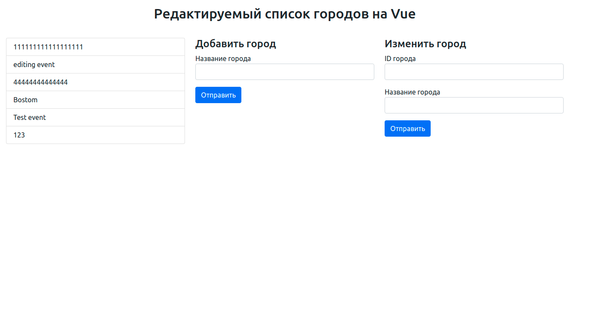

# Project documentation

## Project about

This service is used to share city problrems between habitants same city. 
Also they can put comments to events and suggest solutions to events.

ESAP backend api created on django framework uses REST architecture <br>
Frontend (client) worked on vue.js framework <br>

## Database models

 <br>

## Database models

- model "Solution"
```
class Solution(models.Model):
    todo = models.TextField(verbose_name="Что необходимо сделать?")
    who_needed = models.CharField(max_length=255, verbose_name="Кто требуется для решения?")
    how_complete = models.CharField(max_length=255, verbose_name="Как достигнуть?")
    cost = models.IntegerField(verbose_name="Стоимость")
    term = models.DateField(verbose_name="Сроки решения пробелемы")
    created_at = models.DateTimeField(auto_now_add=True)
    updated_at = models.DateTimeField(auto_now=True)
    
    owner = models.ForeignKey(User, models.CASCADE)
    event = models.ForeignKey(Event, models.CASCADE)
    likes = GenericRelation(Like)
    
    class Meta:
        verbose_name = "Решение"
        verbose_name_plural = "Решения"
```
- model "Event"
```
class Event(models.Model):
    name = models.CharField(max_length=255, verbose_name="Название события")
    description = models.TextField(verbose_name="Описание события",)
    location = models.OneToOneField(Location, models.CASCADE, verbose_name="Адрес события")
    city = models.ForeignKey(City, models.CASCADE, blank=True, null=True)

    is_active = models.BooleanField(default=True)

    # images = models.OneToOneField(Image, models.CASCADE, verbose_name="Изображение события")
    tags = models.ManyToManyField(Tag, blank=True, verbose_name="Категория события")  
    owner = models.ForeignKey(User, models.CASCADE)
    likes = GenericRelation(Like)

    created_at = models.DateTimeField(auto_now_add=True)
    updated_at = models.DateTimeField(auto_now=True)

    class Meta:
        verbose_name = "Событие"
        verbose_name_plural = "События"
```
- Модель "Location"
```
class Location(models.Model):
    street = models.CharField(max_length=50, verbose_name="Улица")
    house = models.CharField(max_length=50, blank=True, verbose_name="Номер дома")
    apartment = models.CharField(max_length=50, blank=True, verbose_name="Номер квартиры")

    created_at = models.DateTimeField(auto_now_add=True, verbose_name="Дата создания")
    updated_at = models.DateTimeField(auto_now=True, verbose_name="дата обновления")

    class Meta:
        verbose_name = _("Адрес")
        verbose_name_plural = _("Адреса")
```
- model "Like"
```
class Like(models.Model):
    user = models.ForeignKey(User, related_name='likes', on_delete=models.CASCADE)
    content_type = models.ForeignKey(ContentType, on_delete=models.CASCADE)
    object_id = models.PositiveIntegerField()
    content_object = GenericForeignKey('content_type', 'object_id')

    class Meta:
        verbose_name = "Лайк"
        verbose_name_plural = "Лайки"
```
- model "News"
```
class News(models.Model):
    title = models.CharField(max_length=256)
    content = models.TextField()
    image = models.ImageField(upload_to=generate_news_upload_to, blank=True, null=True)

    created_at = models.DateTimeField(auto_now_add=True)
    updated_at = models.DateTimeField(auto_now=True)

    class Meta:
        verbose_name = _("Новость")
        verbose_name_plural = _("Новости")
```
- model "Comment"
```
class Comment(models.Model):
    body = models.TextField(verbose_name="Текст комментария")

    created_at = models.DateTimeField(auto_now_add=True)
    updated_at = models.DateTimeField(auto_now=True)

    owner = models.ForeignKey(User, models.CASCADE)
    solution = models.ForeignKey(Solution, models.CASCADE)

    class Meta:
        verbose_name = "Комментарий"
        verbose_name_plural = "Комментарии"
```
- model "Tag"
```
class Tag(models.Model):
    name = models.CharField(max_length=255)
    slug = models.SlugField()

    class Meta:
        verbose_name = "Тег"
        verbose_name_plural = "Теги"
```
- Модель "City"
```
class City(models.Model):
    name = models.CharField(max_length=60, verbose_name="Город")

    class Meta:
        verbose_name = "Город"
        verbose_name_plural = "Города"
```
## Urls

| method | URL | comment |
| ------ | ------ | ------ |
| GET | /cities/ | get cities list |
| POST | /cities/ | create new city |
| PUT | /cities/{id}/ | full update city object |
| PATCH | /cities/{id}/ | partial update city object |
| GET | /events/ | get events list |
| POST | /events/ | create new event |
| GET | /events/popular/ | get events list order by popular |
| GET | /events/{id}/ | get detail event |
| GET | /events/{id}/fans/ | get fans detail event |
| POST | /events/{id}/image/ | add image to detail event |
| POST | /events/{id}/like/ | add like to detail event |
| GET | /events/{id}/solutions/ | get solutions list of detail event |
| POST | /events/{id}/unlike/ | remove like form detail event |

## Pages description

Main page: <br>
 <br>
Vue client has one page with three active methods <br>
There are: <br>
> - Cities list method <br>
> URL: `GET /cities/`
- Create new city method <br>
> URL: `POST /cities/`
- Update detail city method <br>
> URL: `PUT /cities/{id}/`
